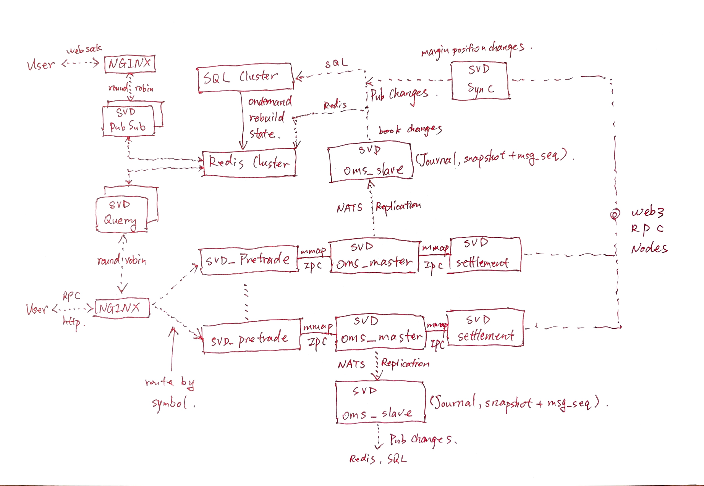

# AGENTS.md

Guidance for AI coding agents (Claude Code, Codex, Cursor, etc.) working in this repository.

## Project overview

dex-rs is a decentralized exchange composed of two halves:

- **On-chain protocols** for margin-account management and settlement management,
  using EVM-compatible address/signature primitives (`alloy` is pinned for chain interop).
- **An off-chain distributed system** for order execution, wired by low latency IPC queue and NATS streaming protocols
  made up of seven services:

  | Service | Responsibility |
  | --- | --- |
  | `svd-pretrade` | Pre-trade risk checks |
  | `svd-oms-master` | Order matching (order management system) |
  | `svd-oms-slave` | off the svd-oms-master load by state replication and publishing changes |
  | `svd-settlement` | Settlement management |
  | `svd-sync` | On-chain state to svd-storage synchronization  |
  | `svd-pub-sub` | System state pub/sub services  |
  | `svd-query` | System state query services  |

## Architecture and design philosophy.
The design targets to 3 critical properties: Low latency, scalability and recoverability. There is no blocking execution
on the hot path. That is why the share memory based SPSC and NATS messaging are employed on the hot path, the other wire
protocols were considered, for example Kafka, Redpanda and Pulsar, as they introduce much more latency with heavy
execution context, so we eventually decide the current design and architecture.

- **The Architecture**

- **Hot path**
[User]---(Order/CancelOrder)--->[NGINX]--->[SVD_Pretrade]--->[SVD_OMS_Master]--->[SVD_Settlement]--->[Web3RPCNodes].
The user's request are routed by symbol as it is explicitly declared in the api path exposed by the SVD_Pretrade, thus
NGINX route the market's request to the corresponding [SVD_Pretrade], in between the SVDs, there is a file mapped share
memory SPSC which provides persistence messaging to wire the pipeline of the market, so the SVDs of the same market are
deployed in the same host for ultra low latency. All the resources required for the computing in this pipeline are
pre-allocated and reused. The book state tracking load of [SVD_OMS_Master] is moved to [SVD_OMS_Slave] by state
replication, thus that the Master can focus on the matching and deliver the trade event to [SVD_Settlement] only.

- **Side path**
[SVD_OMS_Master]---(NATS messages)--->[SVD_OMS_Slave]---(Book State Changes)--->[[Redis_Cluster], [SQL_Cluster],
[SVD_PubSub]].
The master pushes change events via the NATS stream with configurable sync/async mode to the slave node, the replication
introduces the high availability and load sharing of [SVD_OMS_Master] because the [SVD_OMS_Slave] tracks the book state
changes and publish them into [Redis_Cluster], [SQL_Cluster] and the [SVD_PubSub] cluster. Also the [SVD_OMS_Slave] can
switch to an [SVD_OMS_Master] when the [SVD_OMS_Master] is in disaster.

- **MarketData PubSub**
[User]---(websock)--->[NGINX]---(round robin relay)--->[SVD_PubSub]Cluster--->[Redis_Cluster].
The subscription comes from the [User] end via web socket, [NGINX] forward the HTTP handshake to [SVD_PubSub] cluster by
round robin, once the session is being created, the subscriptions from the [User] end are processed in one of the
[SVD_PubSub] instance, the instance then subscribe to [Redis_Cluster] for the corresponding topic asked by the [User].
Both [SVD_OMS_Slave] and [SVD_SYNC] are state change producers, one produces book state changes and the other one
produces margin position changes synced from on-chain settlement protocol. They push the changes to the [Redis_Cluster],
with [Redis_Cluster]'s built-in Pub&Sub protocols, the cluster pushes changes to those [SVD_PubSub] instances which
subscribe to the corresponding topics on demand as the [User] requested.

- **Data Query**
[User]---(HTTP)--->[NGINX]---(round robin relay)--->[SVD_Query]Cluster--->[Redis_Cluster].
The data query comes from User via HTTP RPC, NGINX works as a load balancer which forward the requests to [SVD_Query]
Cluster by round robin. The instance in the cluster fetches data from [Redis_Cluster].

- **OMS_Master and OMS_Slave**
The responsibility of an [SVD_OMS_Master] is that, it executes the user request, and replicate the changes to the
 [SVD_OMS_Slave], it also publish the trade messages to the downstream [SVD_Settlement] service via share memory SPSC
 queue. All the other computing are offload to [SVD_OMS_Slave], for example the statistics, the market data publishing
 over the [Redis_Cluster] and [SQL_Cluster]. The [SVD_OMS_Slave] also manages the snapshot of the book and the NATS
 message sequence, with this checkpoint and the sync point, it manages the state recovery of a book. A slave can be
 switched to a master during runtime.

## Workspace layout

| Crate | Role |
| --- | --- |
| `crates/cache` | common cache libs which place object pool, etc... |
| `crates/cryptography` | common cryptography libs which place hashing, signature signing and verifications, etc... |
| `crates/ipc` | common libs which place IPC functions like shared memory SPSC queue, etc... |
| `crates/net` | common libs which place networking helpers like web socket, https, etc... |
| `crates/primitives` | Core matching-engine types: order model, order book, risk, STP, trades, events, etc... |
| `crates/storage` | helpers for redis cluster and SQL cluster I/O. |
| `crates/svd-oms` | The oms service which runs for different mode: master or slave. |
| `crates/svd-pretrade` | The pre-trade service for pre-trade risk management. |
| `crates/svd-pubsub` | The pubsub service for realtime state change publishing. |
| `crates/svd-settlement` | The settlement service which process the trade events from oms. |
| `crates/svd-sync` | The sync service which sync the on-chain settlement protocol's state to Redis and SQL cluster. |
| `crates/svd-query` | The query service which provides data query for user end request. |
| `crates/util` | Shared helpers |

## Architecture — the matching-engine core

### Order model (hot/cold split)

The order structure is split for cache-line-friendly loading; this design is deliberate
and load-bearing:

- `OrderHot` (`repr(C)`): the data touched on the match path — the `(Address, Nonce)` key,
  `Price`, `Quantity`, `TimeInForce`, `Side`.
- `OrderCold`: `id` (`Hash32`), `symbol`, `Signature`, `TimestampMs`, plus order-type
  parameters in `OrderKind`: `Standard`, `Iceberg`, `PostOnly`, `TrailingStop`, `Pegged`,
  `MarketToLimit`, `ReserveOrder`.
- `OrderNode` (`repr(C, align(64))`): `Order` plus `prev` / `next` `OrderIdx` links forming
  the time-priority queue inside a price level. The links are serialized as part of book
  snapshots (a restored book keeps its list structure); on the wire (Redpanda/Kafka)
  producers must set them to `NIL` — the engine rewrites them on insertion.
- `OrderIdx = u32` with sentinel `NIL = u32::MAX` — a small index type to keep book
  structures cache-friendly.

### Order book (`orderbook::book::OrderBook`)

- All live orders in a `slab::Slab<OrderNode>` arena; bids/asks in
  `BTreeMap<Price, PriceLevel>`; order lookup via `FxHashMap<(Address, Nonce), OrderIdx>`;
  per-user tracking via `FxHashMap<Address, Vec<OrderIdx>>`.
- Each `PriceLevel` holds a time-priority `OrderQueue` (head/tail indices) with
  visible/hidden quantity accounting (iceberg support).
- Non-blocking listener hooks push events out: `TradeListener` (to settlement, storage,
  messaging), `PriceLevelChangedListener`, `OrderStatusListener`, `StatisticListener`.
- Config: tick size, lot size, min/max order size, `STPMode`, `Clock` (injected trait —
  `MonotonicClock` provided), kill switch.
- Pre-trade risk (`orderbook::risk::RiskState`): per-account open-order count, resting
  notional, and price-band (bps vs. a `ReferencePriceSource`) checks. All checks are no-ops
  when no `RiskConfig` is set.
- Self-trade prevention (`orderbook::stp::STPMode`): `None` / `CancelTaker` / `CancelMaker`
  / `CancelBoth`; zero-address orders always bypass STP.
- The matching `impl` (add/cancel/match) is not written yet — only the type structure
  exists.

### Lifecycle and value types

- `TradeResult` carries the taker order, `remaining_quantity`, `MatchOutcome`
  (`Filled` / `PartiallyFilled` / `NotFilled` / `Killed` / `Rejected`), `quote_notional`
  (`Σ price × quantity` as `Quote`), the list of maker `Trade`s, and a `TimestampMs`.
- `OrderStatus` tracks the lifecycle (`Open` → `PartiallyFilled` / `Filled` / `Canceled` /
  `Rejected`) with closed taxonomies of `CancelReason` and `RejectReason`.
- Value types are newtypes over integers: `Price(u64)`, `Quantity(u64)`, `TimestampMs(u64)`,
  `Quote(u128)`; `Symbol` / `Hash32` are `[u8; 32]`. All serialize **transparently** — the
  wire format is MessagePack (rmp-serde) with no wrappers or length prefixes. This is
  load-bearing: round-trip/wire-format tests enforce it, and changing serde annotations can
  break cross-service compatibility.

## Development rules
- Do not allocate heap memory or do any blocking calls on the hot path!
### Toolchain

`rust-toolchain.toml` pins Rust **1.94.1** (first stable of edition 2024, which every crate
uses). CI is pinned to the same version — keep them in lockstep; do not bump one without
updating the other. `Cargo.lock` is committed; dependabot (weekly, Monday 09:00 UTC) owns
dependency bumps with grouped patch/minor updates.

### CI gates (`.github/workflows/ci.yml`)

The single required check `all-checks` composes four jobs — every PR must pass all of:

1. Build & test: `cargo build --workspace --locked` and `cargo nextest run --workspace`
   (CI sets `RUSTFLAGS="-D warnings"` — warnings fail the build)
2. Clippy: `cargo clippy --workspace --all-targets --locked -- -D warnings`
3. Format: `cargo fmt --all -- --check`
4. Dependency audit: `cargo deny check`

### Lint and format configuration

- `clippy.toml`: `cognitive-complexity-threshold = 30`, `type-complexity-threshold = 400`,
  and a `doc-valid-idents` whitelist of domain terms (DEX, Redpanda, OrderBook, …). Add new
  domain terms there rather than sprinkling `#[allow]` on doc lints.
- `rustfmt.toml`: `max_width = 100`, imports/modules reordered, `use_small_heuristics = "Max"`,
  Unix newlines.
- The core crate must stay **executor-agnostic**: no tokio types in public signatures
  (documented in `clippy.toml`; enforced via `#[deny(clippy::disallowed_types)]`).

### Dependency policy (`deny.toml`)

- Sources: crates.io only — git and unknown registries are denied; wildcard versions denied.
- Licenses: permissive / weak-copyleft allow-list (MIT, Apache-2.0, BSD, BSL-1.0, ISC,
  MPL-2.0, …) — new dependencies must fit; `ring` is clarified as `MIT AND ISC AND OpenSSL`.
- Advisories: yanked versions denied, `unsound = all`, `unmaintained = workspace`.

## Conventions

- **Commit messages**: lowercase `<type-or-scope>, <description>`, e.g.
  `feature, zero value definitions for value types.` /
  `refine, cache line friendly structure design for book.` /
  `lint, fix fmt errors.` / `test, fix test.` / `ci, target to main.`
- **Workflow**: feature branch off `main` → PR (CI also runs on merge queues). Branches are
  named for the work (`primitives`, `serde`, `book`, `visibility`, `core`, `impl`).
- **Tests**: inline `#[cfg(test)] mod tests` in the same source file, heavy on MessagePack
  round-trips and wire-format assertions. CI runs nextest; plain `cargo test` works locally.
- **Performance principles**: cache-line-friendly hot/cold splits, lock-free match path,
  no `Copy` for large types, non-blocking listeners. When touching hot structures, preserve
  the layout discipline — there is commit history dedicated to it.
